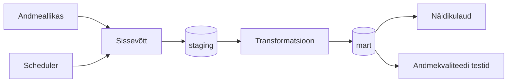

# Vahekohtumehhanismid Euroopa Komisjoni koondumisotsustes

## Äriküsimus

Alates 2000 a. algusest on Euroopa Komisjon oma tingimuslikes koondumisotsustes kasutanud vahekohtuklausleid. Nende puhul on oht, et koondunud ettevõtte kohustuste jõustamine ei ole tegelikkuses konkurentide jaoks võimalik või viib kuluka protsessini. Statistika vahekohtuklauslite kohta Euroopa Komisjoni koondumisotsustes hetkel puudub.  
Antud projekt ehitab Euroopa Komisjoni avalike koondumisotsuste andmestiku põhjal andmevoo vahekohtuklauslite statistika kuvamiseks dashboardile.  
Eesmärk on vastata küsimustele, kui paljudes Euroopa Komisjoni tingimuslikes koondumisotsustest viimasel kuul ja kogu ajaloos on kaalutud vahekohtumehhanismi tingimuste jõustamiseks ning milline on nende otsuste sektoraalne jaotuvus.

**Mõõdikud:**

1. Kalendrikuu otsustes vahekohtumehhanismi mainimine, jah/ei näitaja.  
2. Vahekohtumehhanismi mainivate otsuste koguarv ja osakaal kuude/aastate lõikes.  
3. Millistes NACE tegevusalades on kaalutud vahekohtumehhanismi?  
4. Milline on trend tegevusalati kuude/aastate lõikes?  

## Arhitektuur

Täpsem kirjeldus: [`docs/architecture.md`](docs/architecture.md)

## Andmestik

| Allikas | Tüüp | Uuendamine | Roll |
|---------|------|--------------|------|
| https://compcases-open-data-portal-files-prod.s3.eu-west-1.amazonaws.com/case-data-M.json |JSON | Uueneb otsuste/info lisandumisel (tavaliselt iga kuu) | Algallikas |

## Stack

| Komponent | Tööriist |
|-----------|---------|
| Sissevõtt | Python |
| Transformatsioon | dbt Core 1.10 |
| Andmehoidla | PostgreSQL |
| Näidikulaud | Apache Superset 6.x (või Streamlit) |
| Orkestreerimine | Apache Airflow 3.x  |

