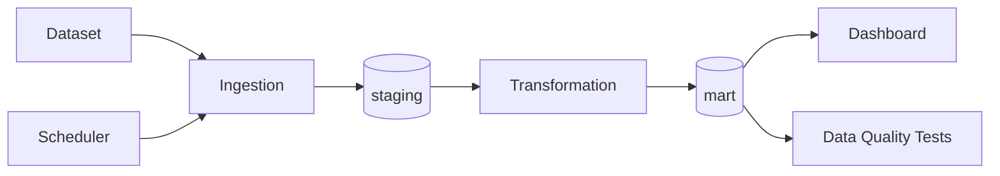

# Arbitration Mechanisms in European Commission Merger Decisions
This project idea originated from a group work completed as part of the University of Tartu Data Engineering training program (March-June 2026).  

## Business Question

Since the early 2000s, the European Commission has used arbitration clauses in its conditional merger decisions. In such cases, there is a risk that the enforcement of commitments by merged companies may not be practically accessible to competitors or may result in a costly process. Currently, there is no statistical overview of arbitration clauses in European Commission merger decisions.

This project builds a data pipeline based on the European Commission’s public merger decision dataset to display statistics on arbitration clauses in a dashboard.

The objective is to answer questions such as: in how many European Commission conditional merger decisions over the last month and across the full historical period has an arbitration mechanism been considered for enforcing commitments, and what is the sectoral distribution of these decisions?

## Architecture

Detailed description: [`docs/architecture.md`](docs/architecture.md)

## Dataset

| Source | Type | Update Frequency | Role |
|---------|------|--------------|------|
| https://compcases-open-data-portal-files-prod.s3.eu-west-1.amazonaws.com/case-data-M.json |JSON | Updated when new decisions/information are added (usually monthly) | Primary data source |

## Stack

| Component | Tool |
|-----------|---------|
| Ingestion | Python |
| Transformation | dbt Core 1.10 |
| Data Repository | PostgreSQL |
| Dashboard | Apache Superset 6.x (või Streamlit) |
| Orchestration | Apache Airflow 3.x  |

