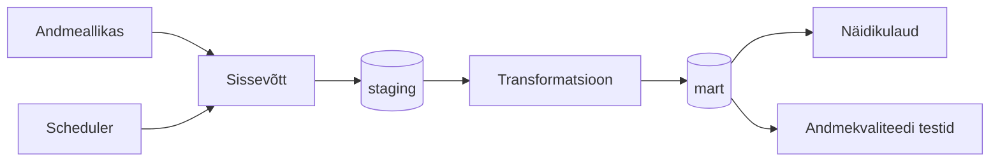
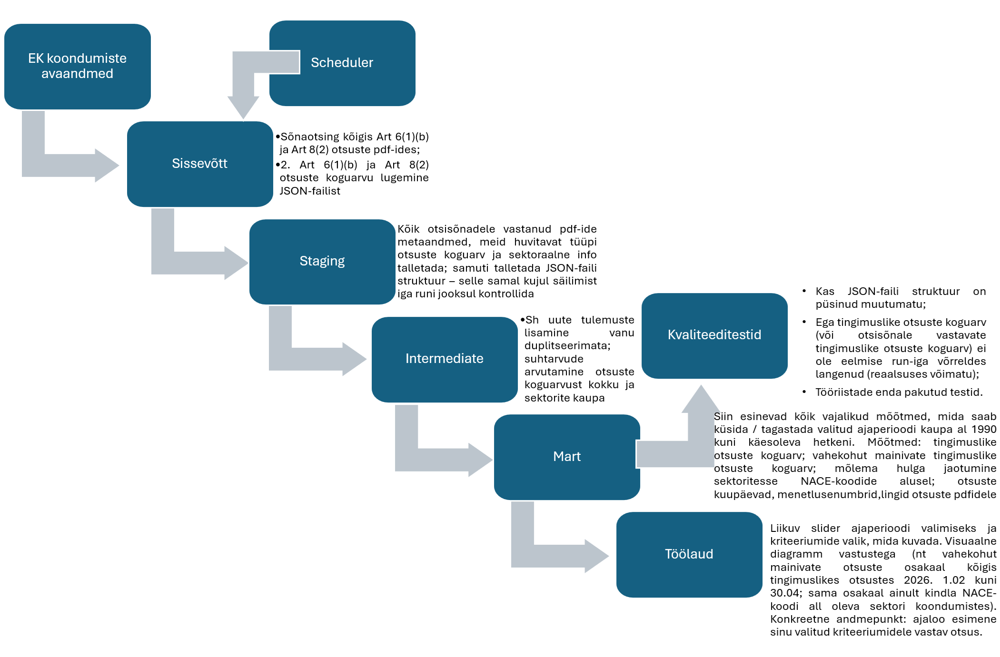

# Arhitektuur

## Äriküsimus

Kui paljudes Euroopa Komisjoni tingimuslikes koondumisotsustest viimasel kuul ja kogu ajaloos on kaalutud vahekohtumehhanismi tingimuste jõustamiseks?  
Milline on nende otsuste sektoraalne jaotuvus?  

## Mõõdikud

1. Kalendrikuu otsustes vahekohtumehhanismi mainimine, jah/ei näitaja.  
2. Vahekohtumehhanismi mainivate otsuste koguarv ja osakaal kuude/aastate lõikes.  
3. Millistes NACE tegevusalades on kaalutud vahekohtumehhanismi?  
4. Milline on trend tegevusalati kuude/aastate lõikes?  

## Andmeallikad

| Allikas | Tüüp | Andmete uuendamine | Roll |
|---------|------|--------------|------|
| https://compcases-open-data-portal-files-prod.s3.eu-west-1.amazonaws.com/case-data-M.json |JSON | Uueneb otsuste/info lisandumisel (tavaliselt iga kuu) | Algallikas |

## Andmevoog

  

## Andmebaasi kihid

| Kiht | Roll |
|------|------|
| `staging` | Hoiab allika andmeid töötlemata kujul. |
| `intermediate` | Rakendab äriloogikat. |
| `mart` | Hoiab transformeeritud ja äriloogikat sisaldavaid tabeleid. |

## Tööjaotus

| Roll | Vastutus | Täitja |
|------|----------|--------|
| Andmeallika omanik | Kirjutab sissevõtu ja uuendamise loogika | Katrin |
| Transformatsioonide omanik | Kirjutab intermediate ja mart kihi mudelid ning mõõdikute arvutuse | Riina, Katrin |
| Kvaliteedi omanik | Kirjutab testid ja vaatab läbi ebaõnnestunud kontrollid | Vahur |
| Näidikulaua omanik | Ehitab näidikulaua ja seob selle äriküsimusega | Riina |

## Riskid

| Risk | Mõju | Maandus |
|------|------|---------|
| Euroopa Komisjoni lehekülg, kust andmed laetakse, on maas | Andmeid ei saa uuendada | Uuendamist korratakse |
| Andmefaili struktuur on muutunud | Ei leia vajalikke väärtusi üles | Faili struktuuri kontroll, muutustest teavitamine |

## Privaatsus ja turve

Andmeallikas on avalik.  
Andmebaasi paroolid salvestatakse `.env` faili.
