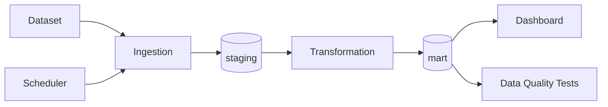

# Architecture

## Business Question

In how many European Commission conditional merger decisions over the last month and across the full historical period has an arbitration mechanism been considered for enforcing commitments?  
What is the sectoral distribution of these decisions?  

## Metrics

1. Mention of an arbitration mechanism in monthly decisions (yes/no indicator).  
2. Total number and share of decisions mentioning arbitration mechanisms by month/year.  
3. In which NACE economic activity sectors have arbitration mechanisms been considered?  
4. What are the trends by sector over months/years?  

## Data Sources

| Source | Type | Data Update Frequency | Role |
|---------|------|----------------------|------|
| https://compcases-open-data-portal-files-prod.s3.eu-west-1.amazonaws.com/case-data-M.json | JSON | Updated when new decisions/information are added (usually monthly) | Primary data source |

## Data Flow

## Database Layers

| Layer | Role |
|------|------|
| `staging` | Stores source data in raw format. |
| `intermediate` | Applies business logic. |
| `mart` | Stores transformed tables containing business logic. |

## Risks

| Risk | Impact | Mitigation |
|------|--------|------------|
| The European Commission webpage used for loading data is unavailable | Data cannot be updated | Retry the update process |
| The structure of the data file has changed | Required values cannot be located | File structure validation and change notifications |

## Privacy and Security

The data source is public.  
Database passwords are stored in the `.env` file.