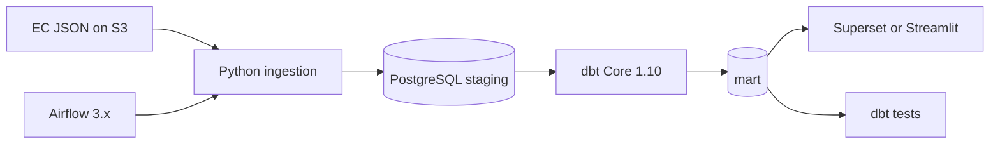

# Project Overview — EU Merger Arbitration Pipeline
Generated by Cursor  

**Generated:** 2026-05-24  
**Scope:** Read-only review of the repository as it exists today (no code was modified).

---

## 1. What this project is

### Purpose

This project builds a **data pipeline** to study **arbitration mechanisms** in **European Commission conditional merger decisions**. The business goal is to produce statistics that do not currently exist in a consolidated form: how often arbitration clauses appear when enforcing merger commitments, over time, by sector (NACE), and for recent vs historical periods.

The work originated from a **University of Tartu Data Engineering** group project (March–June 2026).

### Business questions (from README / architecture)

- In how many EC **conditional** merger decisions (Art. 6(1)(b) or Art. 8(2)) has an arbitration mechanism been considered for enforcing commitments?
- What is the **sectoral distribution** (NACE) of those decisions?
- How do counts and shares evolve **by month/year**, including “last month” views for operational monitoring?

### Target architecture (planned)



### Current implementation status

| Planned component | Status |
|-------------------|--------|
| Download EC merger JSON | **Done** (`ingestion/download_json.py`) |
| Explore JSON structure | **Done** (`ingestion/inspect_json.py`) |
| PDF keyword search | **Done** (`ingestion/ingest.py`) |
| Keyword configuration (no code change) | **Done** (`config/keywords.txt`) |
| Processed hits output | **Done** (`data/processed/`) |
| PostgreSQL + `staging` layer | **Not started** (`data/staging/` exists but is empty) |
| dbt models | **Not started** (listed in `requirements.txt` only) |
| Airflow orchestration | **Not started** |
| Dashboard | **Not started** |
| Docker Compose stack | **Not started** |

**Latest full ingest run** (`logs/ingest_summary.json`, 2026-05-23):

| Metric | Value |
|--------|------:|
| Total cases in JSON | 10,225 |
| Relevant cases (Art. 6(1)(b) or Art. 8(2)) | 9,038 |
| Relevant decisions | 9,041 |
| Matched cases | 15 |
| Matched decisions | 15 |

The pipeline is **ingestion-complete** for phase 1 but **not yet** a full analytics stack.

---

## 2. Repository layout

```
eu-merger-arbitration-pipeline-test/
├── README.md                 # Business context, architecture diagram, stack table
├── requirements.txt          # Python dependencies (ingestion + planned stack)
├── .gitignore
├── config/
│   └── keywords.txt          # Multilingual arbitration search rules
├── data/
│   ├── raw/
│   │   └── case-data-M.json  # ~36 MB EC source file (not in git listing if large)
│   ├── processed/
│   │   ├── arbitration_hits.jsonl
│   │   └── arbitration_hits_readable.json
│   └── staging/                # Empty placeholder for future DB load
├── docs/
│   ├── architecture.md
│   ├── progress.md
│   └── project_overview.md   # This file
├── ingestion/
│   ├── download_json.py
│   ├── inspect_json.py
│   ├── inspect_json_output.txt
│   └── ingest.py
└── logs/
    └── ingest_summary.json
```

**Note:** A local `venv/` may exist on disk but is gitignored.

---

## 3. File-by-file reference

### Root

#### `README.md`

- Describes the **business problem**, target metrics, data source URL, high-level Mermaid flow, and planned stack (Python, dbt, PostgreSQL, Superset/Streamlit, Airflow).
- Points to `docs/architecture.md` for detail.
- **Role:** Primary onboarding document for humans.

#### `requirements.txt`

- **Ingestion:** `requests`, `pdfplumber`
- **Planned:** `dbt-postgres>=1.10`, `apache-airflow>=3.0`
- **Dev:** `pytest>=8`
- **Role:** Dependency manifest; several packages are **not used by any code in the repo yet**.

#### `.gitignore`

- Excludes `.env`, virtualenvs, Python cache, dbt `target/`, IDE folders, logs pattern `*.log`.
- **Does not** exclude `data/` — project docs state raw/processed data are committed when size allows (~35 MB JSON fits).

---

### `config/`

#### `config/keywords.txt`

- **Purpose:** Declarative, language-keyed search rules for arbitration-related terms across EU official languages.
- **Format:** `LANG: term` per line; `#` comments; `*` wildcards; `LANG: a*:b*` for AND (both substrings must appear).
- **Languages covered:** BG, CZ, DA, DE, EL, EN, ES, ET, FI, FR, GA, HR, HU, IT, LT, LV, MT, NL, PL, PT, RO, SK, SL, SV (with some rules commented out where too broad — FR `arbitrag*`, FI `välitys*`, SV `skilje*`).
- **Design intent:** Tune recall/precision **without changing Python** — edit this file and re-run ingest.
- **Consumed by:** `ingestion/ingest.py` only.

---

### `docs/`

#### `docs/architecture.md`

- Restates business questions, defines four metric families, data source, layer names (`staging` / `intermediate` / `mart`), risks (source downtime, schema drift), and privacy (public data; secrets in `.env`).
- **Role:** Design spec for the full pipeline; mostly **aspirational** until dbt/DB exist.

#### `docs/progress.md`

- Detailed **implementation log**: folder structure, keyword rules, each script’s behavior, checkpoint semantics, output schema, test commands (`TEST_LIMIT=20`), and **next steps** (manual validation, dbt, Docker, Airflow, dashboard).
- **Role:** Best single source for *how ingestion was built and why*.

#### `docs/project_overview.md`

- This document.

---

### `ingestion/`

#### `ingestion/download_json.py`

- **Does:** HTTP GET of `case-data-M.json` from the EC S3 open-data portal; writes `data/raw/case-data-M.json`.
- **Behavior:** Skips download if file already exists (manual delete required to refresh).
- **Timeout:** 120 s.
- **Logging:** INFO with timestamps.
- **Entry point:** `python ingestion/download_json.py`

#### `ingestion/inspect_json.py`

- **Does:** Loads raw JSON; filters cases with at least one **Art. 6(1)(b)** or **Art. 8(2)** decision; prints and saves exploratory statistics.
- **Statistics:** Case/decision counts, decision-type breakdown, `caseRegulation`, `caseSimplified`, NACE division sectors, attachment languages, attachment counts, one sample case dump.
- **Helpers:** `first()`, `parse_label()`, `case_has_relevant_decision()` — duplicated conceptually in `ingest.py`.
- **Output:** Console + `ingestion/inspect_json_output.txt` (overwritten each run).
- **Entry point:** `python ingestion/inspect_json.py` (after download).

#### `ingestion/inspect_json_output.txt`

- **Artifact** from a past `inspect_json.py` run (e.g. 10,225 total cases, 9,038 relevant).
- **Role:** Offline reference for JSON shape and distributions; not consumed by other code.

#### `ingestion/ingest.py`

- **Does:** Main **PDF keyword ingestion** pipeline (largest module, ~460 lines).
- **Steps:**
  1. Load and compile regex rules from `keywords.txt` (wildcard + AND).
  2. Load `data/raw/case-data-M.json`.
  3. Filter to cases with Art. 6(1)(b) or Art. 8(2) decisions.
  4. For each case (with optional `TEST_LIMIT` and checkpoint resume): download PDF attachments, extract text via `pdfplumber`, match language-specific rules, build hit records.
  5. Write `data/processed/arbitration_hits.jsonl`, `arbitration_hits_readable.json`, `logs/ingest_summary.json`; delete checkpoint on success.
- **Key functions:**

  | Function | Responsibility |
  |----------|----------------|
  | `load_keywords()` | Parse `keywords.txt` → `{lang: [rules]}` with compiled regex |
  | `is_relevant_case()` | Case-level filter for Art. 6(1)(b) / Art. 8(2) |
  | `search_pdf()` | Temp file + full-text lowercase search |
  | `extract_case_record()` | Normalize JSON list-wrapped fields into output schema |
  | `process_case()` | Download PDFs, find first match, trim decisions |
  | `load_checkpoint()` / `save_checkpoint()` | Resume support |

- **Environment:** `TEST_LIMIT` (int, default 0 = all cases).
- **Entry point:** `python ingestion/ingest.py`

---

### `data/`

#### `data/raw/case-data-M.json`

- **Source:** European Commission merger cases open data (~36 MB).
- **Structure (documented in progress.md):** Top-level dict keyed by `caseNumber`; each case has `metadata`, `caseAttachments`, `decisions[]`; fields are often **single-element lists**; PDF URLs live under `decisions[].decisionAttachments[].metadata.attachmentLink`.

#### `data/processed/arbitration_hits.jsonl`

- **Format:** One JSON object per line (for future dbt/DB load).
- **Content:** Cases where a PDF matched; includes case metadata, **subset of decisions**, `_matchedKeywords`, `_matchedPdfUrl`, `_processedAt`.
- **Current size:** 15 lines (matches summary).

#### `data/processed/arbitration_hits_readable.json`

- Same data as JSONL but as a pretty-printed array for human review on GitHub.

#### `data/staging/`

- Empty directory — placeholder for future PostgreSQL staging loads.

---

### `logs/`

#### `logs/ingest_summary.json`

- Run metadata: totals, match counts, `processedAt`, optional `testLimit`.
- Intended for dashboard denominator: `matchedDecisions / totalRelevantDecisions`.

#### `logs/checkpoint.json` (runtime only)

- Written during ingest; lists processed `caseNumber` values; deleted on successful completion.
- Absent after a successful full run.

---

## 4. Does the code do what it is supposed to do?

### What works well

| Area | Assessment |
|------|------------|
| Download JSON | Correct URL, idempotent skip-if-exists, sensible error handling (`raise_for_status`). |
| JSON exploration | Correctly identifies relevant decision types and produces useful distributions. |
| Keyword config | Clean separation of config vs code; AND/OR/wildcard parsing is coherent. |
| Language-specific search | PDFs searched only with rules for `attachmentLanguage` — avoids cross-language false positives. |
| Case-level relevance filter | Only cases with Art. 6(1)(b) or Art. 8(2) enter the processing loop. |
| Output schema | Rich enough for downstream mart models (case, sector, dates, decision metadata, match provenance). |
| Checkpoint tracking | Processed case IDs persisted after each case — good for crash recovery *in principle*. |
| Full run completed | 9,038 relevant cases processed; 15 hits; summary written. |

### Gaps vs stated business intent

| Issue | Severity | Explanation |
|-------|----------|-------------|
| **PDFs searched on all decision types, not only Art. 6(1)(b) / Art. 8(2)** | High | `process_case()` iterates every decision’s attachments. A case is “relevant” if it has one qualifying decision, but a keyword hit on another decision type (e.g. procedural decision) still produces a hit. This can inflate false positives and mis-attribute matches. |
| **Checkpoint resume drops prior hits** | High | On resume, skipped cases are not re-scanned, but `hits` starts empty and output files are **overwritten** with only matches from the current run segment. A interrupted run that found matches before the crash would **lose those hits** on resume unless outputs are merged manually. |
| **Stops at first matching PDF/decision per case** | Medium | After the first match, remaining PDFs and decisions are not searched. Multiple arbitration mentions in the same case are under-reported. |
| **Semantic precision vs keyword match** | Medium | Example hit (M.3333): context mentions an “arbitration panel” at Bundespatentamt for royalties — may not be the “arbitration mechanism for enforcing commitments” the business question targets. Keyword search cannot distinguish legal concepts without tighter rules or NLP. |
| **Docstring path typo** | Low | Module docstring says output goes to `data/raw/arbitration_hits.jsonl`; actual path is `data/processed/`. |
| **Default language `EN` when missing** | Low | Missing `attachmentLanguage` falls back to English rules, which may be wrong for non-English PDFs. |
| **No PDF download throttling / retries** | Low–Medium | Sequential downloads with 60 s timeout; failures logged at DEBUG and skipped — transient failures silently reduce coverage. |
| **Stack dependencies unused** | N/A (planned) | dbt, Airflow, PostgreSQL, dashboard not implemented — README architecture is **forward-looking**. |
| **Dutch `arbitrag*`** | Medium | Same ambiguity as commented-out French `arbitrag*` (economic “arbitrage” vs dispute resolution) — may cause false positives. |

### Alignment with README metrics

| Metric (architecture) | Ready? |
|-----------------------|--------|
| Monthly yes/no arbitration mention | **Partially** — need decision dates + time aggregation in dbt; ingest provides hits only. |
| Count/share by month/year | **No** — requires mart layer and full decision denominator per period. |
| Sector (NACE) distribution | **Partially** — `caseSectors` on hits; need joins and aggregation. |
| Sector trends over time | **No** — needs mart + dashboard. |

**Conclusion:** Phase-1 ingestion **does** implement “find arbitration-related terms in PDFs of conditionally cleared merger cases,” but several implementation choices mean it **only partially** answers the precise business question. Manual review of `arbitration_hits_readable.json` (planned in `progress.md`) is appropriate before trusting counts.

---

## 5. Proposals for fixes and optimization

Prioritized by impact. None of these have been applied — they are recommendations only.

### Correctness (fix first)

1. **Restrict PDF search to relevant decision types**  
   In `process_case()`, skip decisions whose `decisionTypes` (parsed labels) are not in `RELEVANT_DECISION_TYPES`. Optionally prefer Art. 6(1)(b) over Art. 8(2) when both exist.

2. **Fix checkpoint resume for hits**  
   Options (pick one):
   - Append hits to JSONL incrementally after each match (and merge on resume), or
   - On startup, load existing `arbitration_hits.jsonl` into `hits` when checkpoint is non-empty, or
   - Persist hits per case in `logs/checkpoint_hits/` and merge at end.

3. **Search all relevant PDFs (or document intentional “first hit” policy)**  
   If the business needs exhaustive detection, remove early `break` statements or collect all matches per case/decision. If “first hit” is intentional, document it in README and summary stats.

4. **Tighten keyword false positives**  
   - Review NL `arbitrag*` (and similar) like FR.  
   - Add negative patterns or phrase-level rules (e.g. require “arbitration” near “commitment”, “clause”, “mechanism”) — could stay in `keywords.txt` as AND rules.  
   - Manual validation loop already planned — prioritize reviewing all 15 current hits.

### Reliability & operations

5. **Retries with backoff** for PDF HTTP requests (`urllib3.Retry` or manual loop).

6. **Rate limiting** (sleep between requests) to respect EC infrastructure.

7. **Structured download refresh** in `download_json.py` (ETag / `If-Modified-Since` or compare file size/hash) instead of only “file exists”.

8. **Validate JSON schema** on download (top-level keys, required fields) — aligns with architecture risk mitigation.

### Code quality & maintainability

9. **Extract shared helpers** (`first`, `parse_label`, `is_relevant_case`) into e.g. `ingestion/ec_json_utils.py` to avoid drift between `inspect_json.py` and `ingest.py`.

10. **Fix module docstring** output path (`data/processed/`).

11. **Unit tests** (pytest already in requirements):
    - `load_keywords()` parsing (wildcard, AND, comments, malformed lines)
    - `search_pdf()` with a tiny fixture PDF or mocked text
    - `is_relevant_case()` with minimal JSON fixtures

12. **Logging:** promote repeated PDF failures to WARNING with case number count in summary.

### Performance

13. **Parallel PDF downloads** (thread pool with modest concurrency + rate limit) — 9k+ cases × multiple PDFs is I/O bound; expect large speedup.

14. **Cache downloaded PDFs** under `data/raw/pdfs/{caseNumber}/` to avoid re-download on keyword tuning reruns.

15. **Early skip:** if no rules exist for any attachment language on a case, skip downloads entirely.

### Next pipeline phases (from progress.md)

16. **dbt project:** seed/load `arbitration_hits.jsonl` → staging; models for monthly metrics, NACE rollups, match rate denominators.

17. **Docker Compose:** PostgreSQL + dbt + Airflow + Superset as documented.

18. **Airflow DAG:** monthly `download_json` → `ingest` → dbt run/test.

19. **Dashboard:** Superset or Streamlit on mart tables; wire `ingest_summary.json` denominators or replace with SQL metrics.

20. **Data quality tests:** dbt tests for not-null keys, valid dates, `matchedDecisions <= totalRelevantDecisions`, etc.

---

## 6. Suggested run order (current codebase)

```bash
# 1. Install dependencies (once)
pip install -r requirements.txt

# 2. Download source JSON (~36 MB)
python ingestion/download_json.py

# 3. Optional: explore structure
python ingestion/inspect_json.py

# 4. Test ingest on subset
set TEST_LIMIT=20
python ingestion/ingest.py

# 5. Full ingest (long-running; downloads thousands of PDFs)
set TEST_LIMIT=
python ingestion/ingest.py
```

Review results in `data/processed/arbitration_hits_readable.json` and `logs/ingest_summary.json`.

---

## 7. Summary

This repository implements the **first stage** of a merger-arbitration analytics pipeline: pull EC open data, filter to conditional-clearance decision types, and **search decision PDFs in 24 EU languages** using configurable keywords. It produces machine-readable hits and a run summary suitable for later loading into PostgreSQL and modeling with dbt.

The **planned** warehouse, orchestration, and dashboard layers are documented but **not present in code**. The ingestion layer is functional and has been run at full scale, but **decision-type scoping during PDF search**, **checkpoint/hit persistence on resume**, and **keyword semantic precision** should be addressed before publishing statistics to stakeholders.

For ongoing implementation status, see [`progress.md`](progress.md). For target metrics and layers, see [`architecture.md`](architecture.md).  

