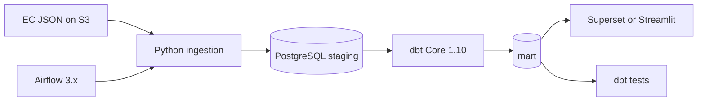

# Project Overview — EU Merger Arbitration Pipeline

**Last updated:** 2026-05-25  
**Companion docs:** [`progress.md`](progress.md) (implementation log), [`architecture.md`](architecture.md) (target design)

---

## 1. What this project is

### Purpose

This project builds a **data pipeline** to study **arbitration mechanisms** in **European Commission conditional merger decisions**. The business goal is to produce statistics that do not currently exist in a consolidated form: how often arbitration clauses appear when enforcing merger commitments, over time, by sector (NACE), and for recent vs historical periods.

The work originated from a **University of Tartu Data Engineering** group project (March–June 2026).

### Business questions (from README / architecture)

- In how many EC **conditional** merger decisions (Art. 6(1)(b) or Art. 8(2)) has an arbitration mechanism been considered for enforcing commitments?
- What is the **sectoral distribution** (NACE) of those decisions?
- How do counts and shares evolve **by month/year**, including “last month” views for operational monitoring?

### Target architecture (planned)



### Current implementation status

| Planned component | Status |
|-------------------|--------|
| Download EC merger JSON | **Done** (`scripts/ingestion/download_json.py`) |
| Explore JSON structure | **Done** (`scripts/ingestion/inspect_json.py`) |
| PDF keyword search | **Done** (`scripts/ingestion/ingest.py`) |
| Keyword configuration (no code change) | **Done** (`config/keywords.txt`) |
| Processed hits output | **Done** (`data/processed/`) |
| PostgreSQL + `staging` layer | **Not started** (`data/staging/` empty) |
| dbt models | **Not started** (in `scripts/requirements.txt` only) |
| Airflow orchestration | **Not started** |
| Dashboard | **Not started** |
| Docker Compose stack | **Not started** |

**Latest full production ingest** (`logs/ingest_summary.json`, 2026-05-24):

| Metric | Value |
|--------|------:|
| Total cases in JSON | 10,229 |
| Relevant cases (Art. 6(1)(b) or Art. 8(2)) | 9,043 |
| Relevant decisions | 9,046 |
| Matched cases | 25 |
| Matched PDFs (`_matches` entries) | 25 |

Phase 1 **ingestion is complete**; warehouse, orchestration, and dashboard are not built yet.

---

## 2. Ingest code review (`scripts/ingestion/ingest.py`)

### Verdict

The ingest implementation is **correct for its documented design** and aligns with [`progress.md`](progress.md). It is suitable for phase-1 keyword discovery and manual validation; it is **not** yet a complete answer to all business metrics (those need dbt + dashboard).

### What the code does correctly

| Behavior | Implementation |
|----------|----------------|
| Case filter | Substring match on `decisionTypes` labels: `"6(1)(b)"` or `"8(2)"` (captures variants such as “with conditions & obligations”, “Modification of Art. 8(2)”) |
| PDF scope | `process_case()` searches PDFs only on decisions whose types match those substrings |
| Language rules | Each PDF uses rules for its `attachmentLanguage` only; no cross-language fallback |
| Early skip | Skips cases when no attachment language has rules (languages normalized with `.upper()`) |
| Keywords | Wildcard and AND rules compiled once; config-driven via `keywords.txt` |
| All matches per case | Collects every matching PDF across qualifying decisions (no early stop after first hit) |
| Checkpoint (full runs) | Keyed by `attachmentLink` URL; saved after **each** PDF; new PDFs on existing cases are picked up on re-run |
| Hit reload on resume | Loads existing `arbitration_hits.jsonl` when checkpoint exists |
| Test isolation | `TEST_LIMIT > 0` disables checkpoint read/write; writes to separate `test_*` files |
| Outputs | Production vs test paths are distinct; `TEST_LIMIT` summary counts use the sliced case set only |
| Hit record | `_matches` list per case (decision index, keywords, `pdfUrl`); matched decisions only in output |

### Known limitations (by design or documented)

| Limitation | Notes |
|------------|--------|
| Crash before write | Matches found after the last checkpoint save but before Step 5 output write are **lost** on resume; checkpoint still skips those PDFs |
| Keyword semantics | Text match ≠ legal “commitment arbitration mechanism”; manual review required |
| No PDF retries | Download failures logged at DEBUG and skipped |
| Early skip scope | Language set for skip includes attachments on **all** decision types (minor edge case; see progress.md) |
| `matchedDecisions` in summary | Counts `_matches` entries (one per matching PDF), not unique decision records |
| Download refresh | Every run re-downloads and validates JSON; ETag / `Last-Modified` skip logic planned for Airflow |

### Alignment: `progress.md` vs code

| Topic | Match? |
|-------|--------|
| Step-by-step ingest logic | Yes |
| Checkpoint + hit reload | Yes |
| Crash limitation | Yes (documented in both) |
| `TEST_LIMIT` / separate test outputs | Yes |
| Substring relevance filter | Yes |
| NL keyword changes | Yes (`arbitrag*` commented; specific NL terms in `keywords.txt`) |
| PT ambiguity note | Documented in progress; `PT: arbitrag*` still active in config |

---

## 3. Repository layout

```
eu-merger-arbitration-pipeline-test/
├── README.md
├── .gitignore
├── config/
│   └── keywords.txt
├── data/
│   ├── raw/
│   │   └── case-data-M.json          # ~36 MB EC source
│   ├── processed/
│   │   ├── arbitration_hits.jsonl    # production hits (dbt input)
│   │   ├── arbitration_hits_readable.json
│   │   ├── test_arbitration_hits.jsonl           # TEST_LIMIT only
│   │   └── test_arbitration_hits_readable.json
│   └── staging/                        # empty; future PostgreSQL load
├── docs/
│   ├── architecture.md
│   ├── progress.md
│   └── project_overview.md
├── logs/
│   ├── ingest_summary.json             # production run stats
│   ├── test_ingest_summary.json        # TEST_LIMIT runs
│   └── checkpoint.json                 # runtime only; deleted on success
└── scripts/
    ├── requirements.txt
    └── ingestion/
        ├── download_json.py
        ├── inspect_json.py
        ├── inspect_json_output.txt
        └── ingest.py
```

A local `venv/` may exist but is gitignored.

---

## 4. File-by-file reference

### Root

| File | Role |
|------|------|
| `README.md` | Business context, architecture diagram, planned stack |
| `.gitignore` | Excludes `.env`, venv, caches; `data/` may be committed (~35 MB JSON) |

### `scripts/requirements.txt`

`requests`, `pdfplumber`; planned `dbt-postgres`, `apache-airflow`; `pytest`.

### `config/keywords.txt`

Multilingual arbitration search rules (`LANG: term`). Wildcards (`*`), AND (`LANG: a*:b*`), comments. Broad rules commented for FR, FI, SV, NL with narrower replacements where needed. Edit this file only to tune search terms.

### `scripts/ingestion/download_json.py`

Downloads EC `case-data-M.json` to `data/raw/` on every run. Uses a `.tmp` file, validates JSON (parse + ≥1000 cases), then replaces the existing file; on failure the old file is kept. Run: `python scripts/ingestion/download_json.py`.

### `scripts/ingestion/inspect_json.py`

Explores JSON structure and statistics for cases with `6(1)(b)` or `8(2)` in decision labels. Writes `scripts/ingestion/inspect_json_output.txt`. Run: `python scripts/ingestion/inspect_json.py`.

### `scripts/ingestion/ingest.py`

Main pipeline (~540 lines). See [§2](#2-ingest-code-review-scriptsingestioningestpy) and [`progress.md`](progress.md) for full logic.

**Production outputs:**

- `data/processed/arbitration_hits.jsonl`
- `data/processed/arbitration_hits_readable.json`
- `logs/ingest_summary.json`

**Test outputs** (`TEST_LIMIT` set):

- `data/processed/test_arbitration_hits.jsonl`
- `data/processed/test_arbitration_hits_readable.json`
- `logs/test_ingest_summary.json`

### `data/processed/arbitration_hits.jsonl`

One JSON object per line per matched case. Includes case metadata, matched decisions only, and `_matches` (per-PDF keyword hits), `_processedAt`. Current production file: **25 hits** (re-run after keyword or code changes may update this).

### `docs/progress.md`

Authoritative implementation log and run instructions. Prefer this over this overview for day-to-day ingest details.

### `docs/architecture.md`

Target metrics, DB layers (`staging` / `intermediate` / `mart`), risks — mostly future state.

---

## 5. Metrics readiness

| Metric (architecture) | Status |
|-----------------------|--------|
| Arbitration mention yes/no per decision | **Partial** — hits exist; denominator in `ingest_summary.json` |
| Share `matchedDecisions / totalRelevantDecisions` | **Partial** — summary has both values (`matchedDecisions` = matching PDF count) |
| Count/share by month/year | **No** — needs dbt time aggregation |
| Sector (NACE) distribution | **Partial** — `caseSectors` on hits; needs mart |
| Sector trends over time | **No** — needs mart + dashboard |

---

## 6. Suggested run order

Run from the **repository root**:

```bash
pip install -r scripts/requirements.txt

python scripts/ingestion/download_json.py
python scripts/ingestion/inspect_json.py          # optional

# Test (does not touch production outputs or checkpoint)
# Linux/macOS:
TEST_LIMIT=20 python scripts/ingestion/ingest.py
# Windows PowerShell:
$env:TEST_LIMIT=20; python scripts/ingestion/ingest.py

# Full production run
python scripts/ingestion/ingest.py
```

Review production results in `data/processed/arbitration_hits_readable.json` and `logs/ingest_summary.json`.

After keyword changes: delete `logs/checkpoint.json` if present; delete or back up `arbitration_hits.jsonl` for a clean re-run (resume merges from last written jsonl).

---

## 7. Remaining work (prioritized)

### Ingestion quality (before trusting published stats)

1. Manual review of all hits in `arbitration_hits_readable.json` (false positives, PT/EN context).
2. Refine `keywords.txt` based on review; re-run full ingest.
3. Optional: append hits to jsonl after each match to survive crashes without re-scan gaps.

### Pipeline build-out (from progress.md)

4. dbt project — load `arbitration_hits.jsonl` into PostgreSQL staging/mart.
5. Docker Compose — PostgreSQL, dbt, Airflow, Superset.
6. Airflow DAG — monthly download → ingest → dbt run/test.
7. Dashboard — Superset or Streamlit.

### Code quality (optional)

8. Extract shared helpers (`first`, `parse_label`, relevance checks) shared by `inspect_json.py` and `ingest.py`.
9. pytest fixtures for `load_keywords()`, `is_relevant_case()`, `search_pdf()`.
10. PDF download retries and polite rate limiting.
11. ETag / `Last-Modified` conditional download in `download_json.py` (planned for Airflow stage).

---

## 8. Summary

The repository delivers a **working phase-1 pipeline**: download EC merger open data (with validation), filter to conditional-clearance decision types via label substrings, search decision PDFs in many EU languages via configurable keywords, and emit production and test outputs with PDF-level checkpoint resume for full runs.

`ingest.py` and `progress.md` are **in sync**. The main gaps are **business validation of hits**, **crash-safe hit persistence** (optional improvement), and **everything after ingestion** (PostgreSQL, dbt, Airflow, dashboard).

For implementation detail and changelog-style notes, use [`progress.md`](progress.md).
